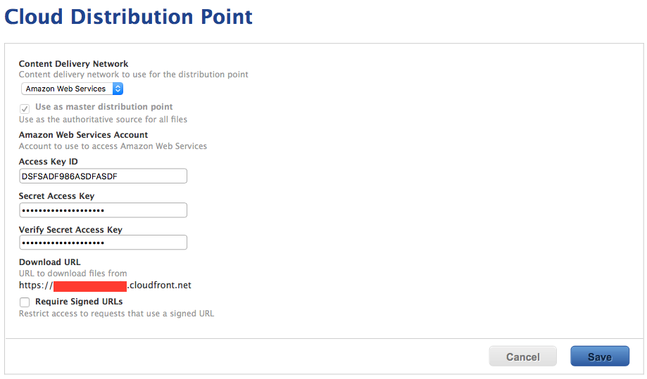
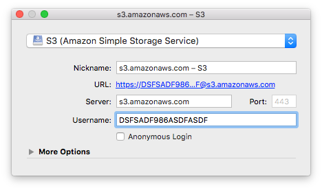
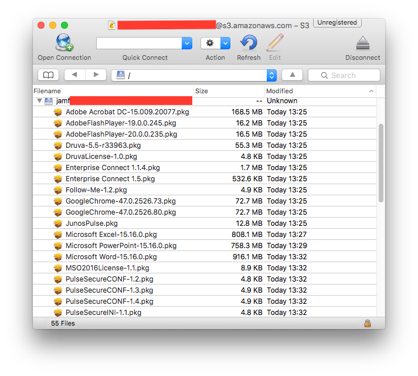

# Configuring Cloud Distribution Points

## Concept

A Cloud Distribution Point (CDP) is a glorified FTP service. 
Currently, the JSS supports:

- Amazon Web Services (S3 + CloudFront)
- Rackspace Cloud Files
- Akamai

I will currently focus on Amazon S3. Feel free to fork and add more info.

### Amazon S3 + CloudFront

As told earlier, Amazon S3 is a glorified FTP service. It's available from Amazon Web Services, and permit to store your files online. On top of that, we use CloudFront, that replicates your Amazon S3 data to all Amazon datacenters worldwide. Quite neat! But all great things come with a cost. Be careful with what you store. Perhaps it's time to leverage your applications autoupdate mechanisms! 

**Note:** CloudFront automatically replicates your files accross all Amazon datacenters. That means there will be a few minutes delay until your files are available everywhere.

### Common setups

#### A single Cloud Distribution Point

- Few users or few packages
- small, spread-out websites

#### CDP acting as 'backup' DP

- Provide data wherever the user is (= outside of the network)
- Provide data to small sites that don't need/want a local server

#### CDP for some files

Setup a CDP and select which files you want to provide from it.

- Provide a fail-safe Distribution Point for small packages

## Setting up
### Amazon S3

You need to create a IAM (Identity Access Management) group, user, and assign a profile to limit its access rights.

1. Navigate to IAM
2. Create a group `jamf-group`
2. Create a user `jamf-user`
3. Assign the user `jamf-user` to the group `jamf-group`
4. Create and assign policy `jamf-policy` (see below) to the group `jamf-group`

With AWS CLI: 

```
# Create group
aws iam create-group --group-name jamf-group --output table

# Create user
aws iam create-user --user-name jamf-user --output table

# Create an access key for this user (will dump AcessKeyId and SecretAccessKey)
aws iam create-access-key --user-name jamf-user

# Add user to group 
aws iam add-user-to-group --user-name jamf-user --group-name jamf-group

# Assign policy to group
aws iam put-group-policy --group-name jamf-group --policy-document file://./jamf-group-policy.json --policy-name jamf-policy

# Check if it's working well:
aws iam get-group --group-name jamf-group --output table
aws iam get-group-policy --group-name jamf-group --policy-name jamf-policy --output table

```

Your `jamf-policy` file:

```json
{
    "Version": "2016-01-05",
    "Statement": [
        {
            
            "Effect": "Allow",
            "Action": [
                "s3:*"
            ],
            "Resource": [
                "*"
            ]
        },
        {
            
            "Effect": "Allow",
            "Action": [
                "cloudfront:CreateCloudFrontOriginAccessIdentity",
                "cloudfront:CreateDistribution",
                "cloudfront:CreateInvalidation",
                "cloudfront:CreateStreamingDistribution",
                "cloudfront:GetCloudFrontOriginAccessIdentity",
                "cloudfront:GetCloudFrontOriginAccessIdentityConfig",
                "cloudfront:GetDistribution",
                "cloudfront:GetDistributionConfig",
                "cloudfront:GetInvalidation",
                "cloudfront:GetStreamingDistribution",
                "cloudfront:GetStreamingDistributionConfig",
                "cloudfront:ListCloudFrontOriginAccessIdentities",
                "cloudfront:ListDistributions",
                "cloudfront:ListInvalidations",
                "cloudfront:ListStreamingDistributions",
                "cloudfront:UpdateCloudFrontOriginAccessIdentity",
                "cloudfront:UpdateDistribution",
                "cloudfront:UpdateStreamingDistribution"
            ],
            "Resource": [
                "*"
            ]
        }
    ]
}
```

**TODO:** need to try to use "jamf*" as the ressource.

### JSS
**Warning!** Make sure you're using Java JDK 1.7. There's a known bug with JDK 1.8. Check on command-line with `java -version`.

```
$ java -version
java version "1.7.0_91"
OpenJDK Runtime Environment (rhel-2.6.2.3.el7-x86_64 u91-b00)
OpenJDK 64-Bit Server VM (build 24.91-b01, mixed mode)
```
Tip for Centos users: if you installed 1.8 by mistake, try `sudo yum swap java-1.8.0-openjdk.x86_64 java-1.7.0-openjdk.x86_64` then `sudo systemctl restart jamf.tomcat7.service` to restart the JSS. 

#### Amazon S3

1. Navigate to Settings > Computer Management > Cloud Distribution Point
2. Enter all the relevant info you provided earlier.



### AutoPkg

The JSS is acting as a dispatcher. You simply need to provide the necessary [information](https://github.com/sheagcraig/JSSImporter#cdp-and-jds-cloud-distribution-point-and-jamf-distribution-servers).

Example:
 
```bash

# Check the current settings:
defaults read ~/Library/Preferences/com.github.autopkg.plist

# Setup the array (optional if you have something already)
/usr/libexec/PlistBuddy -c "Add :JSS_REPOS array" ~/Library/Preferences/com.github.autopkg.plist

# Setup a new dict (make sure to change index number if you have some already)
/usr/libexec/PlistBuddy -c "Add :JSS_REPOS:0 dict" ~/Library/Preferences/com.github.autopkg.plist
/usr/libexec/PlistBuddy -c "Add :JSS_REPOS:0:type string CDP" ~/Library/Preferences/com.github.autopkg.plist
```


## Testing

### Listing the files on Amazon S3 with Cyberduck
I found out the easiest way to see what's actually store on Amazon S3 is to use Cyberduck. Simply add a profile with "S3 (Amazon Simple Storage Service).

**Note:** your file may take several minutes to show up here.



